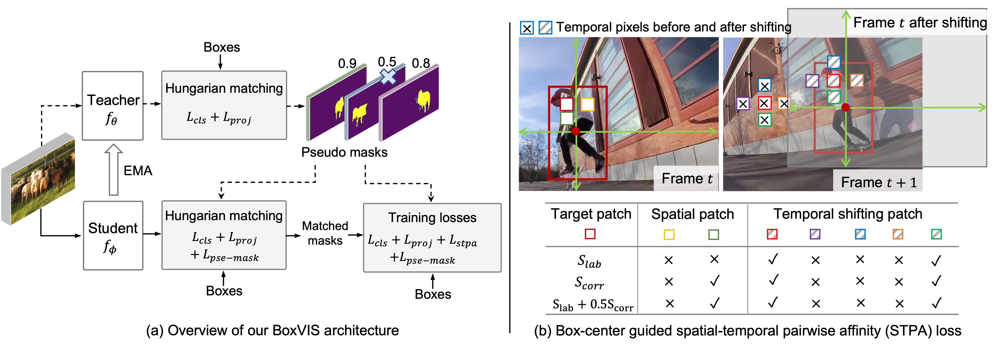

# BoxVIS: Video Instance Segmentation with Box Annotation

[LI Minghan](https://scholar.google.com/citations?user=LhdBgMAAAAAJ) and [ZHANG Lei](https://www4.comp.polyu.edu.hk/~cslzhang/)

[[`arXiv`]()] 

<div align="center">
  
</div><br/>

## Updates
* **`March 28, 2023`:** Paper is available now. 

## Quantitative performance comparison between pixel-supervised and box-supervised methods 
<div align="center">
  
</div><br/>

## <a name="CitingBoxVIS"></a>Citing BoxVIS

If you use BoxVIS in your research or wish to refer to the baseline results published in the Model Zoo, please use the following BibTeX entry.

```BibTeX
@inproceedings{li2022boxvis,
  title={BoxVIS: Video Instance Segmentation with Box Annotation},
  author={Minghan Li and Zhang Lei},
  journal={.},
  year={2023}
}
```

## Acknowledgement

Our code is largely based on [Detectron2](https://github.com/facebookresearch/detectron2), [IFC](https://github.com/sukjunhwang/IFC), [Deformable DETR](https://github.com/fundamentalvision/Deformable-DETR) and [VITA](https://github.com/sukjunhwang/VITA). We are truly grateful for their excellent work.
